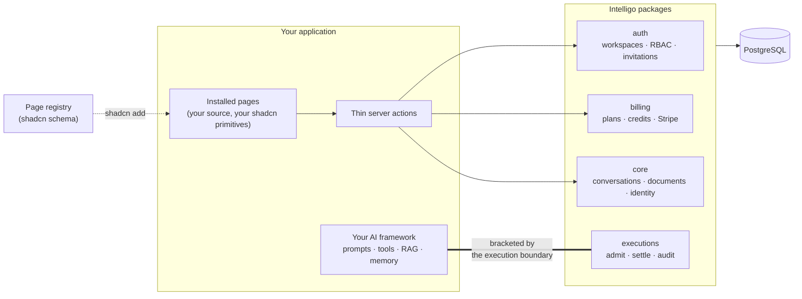

<div align="center">

# Intelligo

**The application framework for vertical AI SaaS.**

You build the agent with the AI framework of your choice.<br/>
Intelligo is everything around it — tested, typed, and yours.

<a href="https://github.com/intelligo-mn/framework/actions/workflows/ci.yml"></a>
<a href="https://www.npmjs.com/package/@intelligo-dev/core"></a>


[Quickstart](#quickstart) · [Features](#features) · [Pages](#pages) · [Architecture](#architecture) · [Decisions](#design-decisions)

</div>

> **Status: 1.0 beta.** Published to npm under the `beta` dist-tag (`@intelligo-dev/*@beta`); APIs are settling until 1.0. Everything on this page exists and runs today — nothing is aspirational.

## Why

An AI product is two halves. The interesting half is your agent: the prompts, the tools, the domain knowledge nobody else has. The other half is the same in every AI SaaS ever built — who is signed in, which workspace they belong to, whether their plan allows this request, what it cost, who to bill, and what to tell an auditor later.

Teams spend most of their time rebuilding that second half. Intelligo ships it finished, and stays completely out of the first: no `IntelligoAgent`, no wrapper around your model calls, no new agent API to learn.



## Quickstart

Prerequisites: Node 22.14+, pnpm 9, a PostgreSQL database (Neon works well).

```bash
npx @intelligo-dev/cli@beta create my-app
cd my-app && pnpm install

pnpm dlx shadcn@latest add https://intelligo.dev/r/app-shell.json --yes   # repeat per item
```

Copy `.env.example` to `.env.local` and set `DATABASE_URL` and `BETTER_AUTH_SECRET`, then `pnpm db:migrate` (the framework's migration chain, then your own) and `pnpm dev`. The chat page streams against a built-in stub model, so the entire surface — sign-up, verification, workspaces, team, billing, usage, chat, artifacts — runs before you configure an AI provider.

Prefer to explore first? Clone this repository, run `pnpm install && pnpm dev`, and open **`apps/app`**, the reference application: a complete generic workspace AI SaaS built from nothing but the public packages and installed registry items. CI recreates it from a clean scaffold on every run.

## Features

### Identity & tenancy — [`packages/auth`](packages/auth)

- Email/password and OAuth sign-in, email verification, password reset — and the transactional emails behind them
- Multi-tenant workspaces (owner / admin / member) on Better-Auth's organization model, with an active workspace that persists across requests
- The full invitation lifecycle: duplicate prevention, expiry, cancellation, and acceptance with pre- **and** post-verification so a forged id cannot join a workspace — idempotent on retry
- Role changes, member removal, sole-owner protection, ownership transfer, plan-limited workspace creation
- Ports-based services (`createTeamService`, `createWorkspaceService`, `createProfileService`, `createOnboardingService`) with typed errors, unit **and** real-database test suites
- Platform admin is a database row, not an env var — with audited impersonation

### Commerce — [`packages/billing`](packages/billing)

- A plan registry your product registers into: plans are data, never hardcoded in the framework — reachable from a client bundle through subpaths that import neither Stripe nor `server-only`
- Feature gates, per-feature quotas, monthly token quotas with grace overage, per-workspace rate limiting
- Credit balances with worst-case **reservations**: funds held for the duration of a run, released on failure, expired on a TTL if the run dies
- Trials with provisioning, per-email abuse checks, expiry processing, and conversion to paid
- Stripe subscriptions, one-time credit packs, billing portal, and webhooks made idempotent through a finance-event ledger — plus a provider seam for regional payment providers Stripe doesn't cover
- Billing views shaped server-side per role (member / admin / owner)

### The execution boundary — [`packages/executions`](packages/executions)

Every AI run is bracketed, never wrapped — your route stays written in your framework's own idiom:

```ts
const run = await executions.begin({ workspaceId, userId, capability, model });
if (!run.allowed) return refuse(run.reason);
// ... your framework, your code ...
await run.complete({ usage }); // or run.fail({ error })
```

- **Admit**: entitlement checked through a port, worst-case cost reserved, execution row written
- **Settle**: actual tokens and cost recorded, credits charged — idempotent via compare-and-swap, so a duplicate `complete` cannot double-bill
- **Fail**: reservation released, error recorded; refusals leave audit events
- Model ids are registry keys with per-token pricing and output budgets; an unregistered id is an architecture-test failure, not a silent mis-bill
- Cost converts through a live FX rate and configurable margin; per-request records and monthly rollups feed the dashboards through a query API

### Chat — [`packages/chat`](packages/chat)

The AI-SDK-native transport as a function, so the UI that installs from the registry never has to be edited to change how a turn runs:

```ts
// app/api/chat/route.ts
export const { POST, DELETE } = createChatHandler(chatServerConfig);
```

- Every turn: auth → the plan's rate limit → feature gate → conversation persistence → `executions.begin()` → `streamText` → settled exactly once
- Seams, not vocabulary: `resolveAgent` (an agent per conversation, from the body or a table), `prepareMessages` (windowing, summaries, injected context), attachments, reasoning, a sync or model-written title, `onTurn` telemetry, a localised translator
- Web `Request`/`Response` in and out; nothing here imports `next/*` — that is [`packages/next`](packages/next), the framework's one Next.js adapter
- A deterministic stub model, so a clean install streams with no API key

### Persistence & privacy — [`packages/core`](packages/core)

- Conversations and messages: cursor-paginated history, renaming, votes, trailing-message deletion for regeneration, and a batched upsert built for streaming writes
- Documents/artifacts with versioning, a registrable title classifier, and ownership checks on every read
- User notifications with read state and product-registrable triggers
- A real privacy surface: self-auditing data export, a memory-audit trail, per-fact deletion
- Every operation takes a resolved actor and enforces workspace + user scoping **inside the service**, not in the page

### Operations — [`packages/jobs`](packages/jobs) · [`packages/audit`](packages/audit) · [`packages/admin`](packages/admin) · [`packages/cli`](packages/cli)

- Postgres-backed job queue (`FOR UPDATE SKIP LOCKED`, retries, backoff) — no Redis
- Append-only audit events
- Admin console: platform overview, operations, integration health, audited impersonation
- CLI: `create` scaffolds a registry-ready application (shadcn, Tailwind 4, next-intl, a composition root wired to the execution boundary, a drizzle config for the tables you own); `migrate` applies the framework's migration chain and `migrate --check` gates a deploy on it; `doctor`, and `upgrade --check` know which generated files you customized — by content hash — and refuse to clobber them

## Pages

Twenty-eight page families install into your application as **source you own**, through the official [shadcn registry](https://ui.shadcn.com/docs/registry) protocol — pages, components, loading/empty/error states, and thin actions, rendered by your own shadcn primitives:

|                    |                      |                       |                           |
| ------------------ | -------------------- | --------------------- | ------------------------- |
| `auth-login`       | `auth-signup`        | `auth-password-reset` | `auth-email-verification` |
| `onboarding`       | `invitation-accept`  | `app-shell`           | `dashboard`               |
| `settings-shell`   | `workspace-settings` | `team-settings`       | `profile-settings`        |
| `privacy-settings` | `language-switcher`  | `notifications`       | `route-error`             |
| `pricing`          | `checkout`           | `billing-settings`    | `usage`                   |
| `feature-gating`   | `trial-banner`       | `payment-poll`        | `artifacts`               |
| `chat`             | `chat-panel`         | `chat-widget`         | `chat-share`              |
| _+ a smoke canary_ |                      |                       |                           |

Three rules make installed pages hold up over time:

1. **Installed components are used as-is.** What a deployment varies arrives through config files the items ship for you to edit: navigation, banners, onboarding steps, credit bundles, chat identity, conversation starters, tool renderers, workspace bootstrapping.
2. **Copy is translation, not code.** Every item reads its strings from a per-item [next-intl](https://next-intl.dev) namespace and ships `messages/en/<item>.json`. Adding a language means adding message files — never editing a component.
3. **Business rules live behind the pages.** An installed action parses, calls a typed service, maps the error, revalidates. The invariants are in the packages, tested against a real database.

## Architecture

- **One PostgreSQL database**, explicit per-table ownership. pgvector rides along; no Redis, no separate vector store.
- **One service layer, two thin transports** — Server Actions for internal mutations, route handlers for streaming and webhooks. Business rules only in services.
- **One explicit composition root** per application. Import-side-effect registration is banned.
- **Architecture as failing tests, not documents**: dependency direction, tenant scoping, registry hygiene (no private imports, every dependency declared), and model-id registration all break the build when violated.

```text
packages/registry/ page registry: registry.json + item source, a private workspace (built with `pnpm registry:build`)
packages/          core · auth · next · billing · chat · executions · audit · jobs · admin · mastra · cli
apps/app           the reference application — the registry's canonical installed result
apps/site          intelligo.dev — the public site, which also serves the registry at /r
docs/adr/          the decisions, as ADRs
tests/architecture the rules, as tests
```

## Compared to the alternatives

| If you would otherwise…             | What's different here                                                                                                                                                                       |
| ----------------------------------- | ------------------------------------------------------------------------------------------------------------------------------------------------------------------------------------------- |
| **Build it in-house**               | The undifferentiated 70% — tenancy, entitlements, credits, metering, billing, audit — arrives as typed services with unit, real-database, and architecture test suites already around them. |
| **Start from a SaaS boilerplate**   | A boilerplate is a fork you maintain alone. Here the services stay upgradable packages, and pages are registry installs with the variance isolated into config and message files.           |
| **Adopt an all-in-one AI platform** | Those own your agent. Intelligo structurally cannot: it has no agent abstraction to lock you into — it only admits, settles, and records the runs your own framework produces.              |

## Design decisions

Recorded as ADRs in [docs/adr](docs/adr/README.md):

- AI frameworks stay native; Intelligo records only the execution boundary
- One PostgreSQL database, explicit per-table ownership
- One service layer behind two thin transports, one composition root
- The execution boundary is a lifecycle with ports, not a wrapper
- Conversation and document persistence are framework capabilities
- Registry items are i18n-native and installed unmodified
- One package per runtime target; shared types are subpaths; the registry is a private workspace
- The chat transport is a package; the chat UI is registry source
- One design system: shadcn base-nova, an additive token contract, a tiered catalog
- One runtime seam, consumer-owned bindings, and the tool renderer contract
- Money is micros with a currency attached; a deployment declares the one it bills in

## What it is not

Not an AI framework, and not a wrapper over one. Not a component library — the registry ships pages; primitives come from shadcn's own registry. Not a hosted platform; you deploy it like any Next.js application. There is no runtime plugin system — composition is build-time, on purpose. The registry is served at `https://intelligo.dev/r/<item>.json` by `apps/site`; a checkout can also install from the locally built artifacts.

## Development

```bash
pnpm dev              # all apps
pnpm test             # unit, real-database integration, and architecture suites
pnpm lint && pnpm type-check
pnpm registry:build   # rebuild the page registry artifacts
pnpm db:push          # push the Drizzle schema
```

Releases: one commit bumps every published package and heads `CHANGELOG.md` with its section; merging it to main publishes to npm, tags, and creates the GitHub release (`.github/workflows/release.yml`). The site and the hosted registry deploy from `apps/site`. See [CONTRIBUTING.md](CONTRIBUTING.md), [SECURITY.md](SECURITY.md) and [SUPPORT.md](SUPPORT.md). Working on the framework itself from a clone, `pnpm exec tsx packages/cli/src/bin.ts create apps/my-app --link-workspace` scaffolds an app against the workspace packages and `pnpm registry:build` installs items from `packages/registry/public/r`.

## License

[Apache-2.0](LICENSE) · [NOTICE](NOTICE) · [TRADEMARK.md](TRADEMARK.md) · [Code of conduct](CODE_OF_CONDUCT.md)
