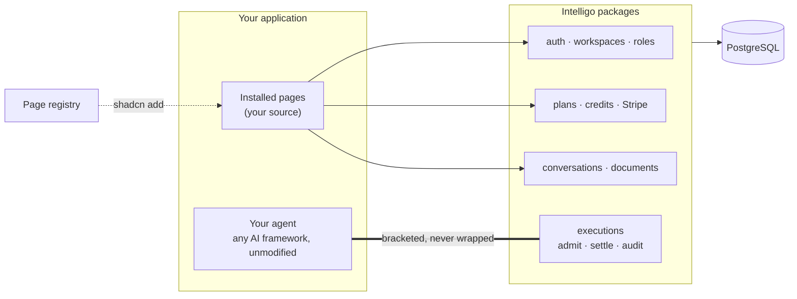

<div align="center">

# Intelligo

**The application framework for vertical AI SaaS.**

You build the agent, with the AI framework you already use.<br/>
Intelligo is everything around it — and it is tested, typed, and yours.

<a href="https://github.com/intelligo-mn/framework/actions/workflows/ci.yml"></a>
<a href="https://www.npmjs.com/package/@intelligo-dev/core"></a>


[Website](https://intelligo.dev) · [Docs](https://intelligo.dev/docs) · [Pages](https://intelligo.dev/blocks) · [Components](https://intelligo.dev/components) · [Architecture](https://intelligo.dev/architecture) · [Why](https://intelligo.dev/why)

<a href="https://intelligo.dev/#film">
  <picture>
    <source media="(prefers-color-scheme: dark)" srcset="apps/website/public/film/teaser-dark.gif" />
    
  </picture>
</a>

<sub>The first twelve seconds. <a href="https://intelligo.dev/#film">Watch the whole minute</a> — pages as source, the execution boundary, usage, and the config that makes it yours.</sub>

</div>

> **Status: 1.0 beta.** On npm under the `beta` dist-tag (`@intelligo-dev/*@beta`); APIs are settling until 1.0. Everything on this page exists and runs today.

## The other half

An AI product is two halves.

One is your agent: the prompts, the tools, the domain knowledge nobody else has. That half is why the product exists.

The other is the same in every AI SaaS ever built: who is signed in, which workspace they belong to, whether their plan allows this request, what it cost, who to bill, and what to tell an auditor later. Teams spend most of their time rebuilding it.

Intelligo ships the second half finished and stays out of the first. There is no `IntelligoAgent`, no wrapper around your model calls, no new agent API to learn — use the Vercel AI SDK, Mastra, or anything else, exactly as its own docs describe.



## Quickstart

You need Node 22.14+, pnpm 9, and PostgreSQL with pgvector (Neon, Supabase, or `docker run pgvector/pgvector:pg17`).

```bash
pnpm dlx @intelligo-dev/cli@beta create my-app
cd my-app && pnpm install

# Pages install in dependency order — intelligo.dev/docs/registry/install-order
for item in route-error app-shell auth-login auth-signup dashboard chat; do
  pnpm dlx shadcn@latest add "https://intelligo.dev/r/$item.json" --yes
done
```

Copy `.env.example` to `.env.local`, set `DATABASE_URL` and `BETTER_AUTH_SECRET` (`openssl rand -base64 32`), then:

```bash
pnpm db:migrate   # the framework's schema, then your own tables
pnpm dev
```

Sign up, land on the dashboard, and chat. The chat streams against a built-in stub model and emails print to the server console, so nothing else needs configuring first. Team, billing, usage, notifications and artifacts are more items from the same registry. The [getting-started guide](https://intelligo.dev/docs/getting-started) takes it from here, and [Bring your agent](https://intelligo.dev/docs/guides/bring-your-agent) shows where yours plugs in.

## One request, end to end

Every AI run is **bracketed, never wrapped**. Your route stays written in your framework's own idiom; Intelligo stands on either side of it:

```ts
const run = await executions.begin({ workspaceId, userId, capability, model });
if (!run.allowed) return refuse(run.reason);

const result = await yourAgent.generate(messages); // your framework, unmodified

await run.complete({ usage: result.usage }); // or, in catch: run.fail({ error })
```

- **Admit** — the plan is checked through a port, the worst-case cost is held against the workspace's credits, and an execution row is written. A refusal is recorded too.
- **Run** — your code. The handle knows nothing about messages, tools or models.
- **Settle** — actual tokens and cost are recorded and the credits charged, by compare-and-swap, so a duplicate `complete` cannot double-bill. On failure the hold is released; if the process dies, it expires.

Model ids are registry keys with per-token pricing. An id with no price is refused at admission and fails an architecture test — never a silent mis-bill. If you would rather not write the route at all, `@intelligo-dev/chat` is the same lifecycle as two lines:

```ts
// app/api/chat/route.ts
export const { POST, DELETE } = createChatHandler(chatServerConfig);
```

## What ships

Services live in npm packages you upgrade. Each takes its dependencies as ports, returns typed errors, and is tested against a real database.

| Package                                            | What it gives you                                                                                                                                                                     |
| -------------------------------------------------- | ------------------------------------------------------------------------------------------------------------------------------------------------------------------------------------- |
| [`@intelligo-dev/auth`](packages/auth)             | Email/password and OAuth, verification, reset; multi-tenant workspaces with owner/admin/member; the full invitation lifecycle; ownership transfer; audited impersonation              |
| [`@intelligo-dev/billing`](packages/billing)       | A plan registry your product fills; feature gates, quotas, rate limits; credit balances with reservations; trials; Stripe subscriptions, credit packs and idempotent webhooks         |
| [`@intelligo-dev/executions`](packages/executions) | The execution boundary above; the model-pricing registry; cost with FX and margin; per-request records and monthly rollups behind a query API                                         |
| [`@intelligo-dev/chat`](packages/chat)             | The AI-SDK-native chat transport: auth → rate limit → feature gate → persistence → `executions.begin()` → stream → settled once. Seams for agents, context, attachments and titles    |
| [`@intelligo-dev/core`](packages/core)             | The schema (Drizzle, Postgres, pgvector); conversations, versioned documents, notifications; data export and per-fact deletion; email, logging, env                                   |
| [`@intelligo-dev/jobs`](packages/jobs)             | A Postgres-backed job queue — `FOR UPDATE SKIP LOCKED`, retries, backoff. No Redis                                                                                                    |
| [`@intelligo-dev/audit`](packages/audit)           | Append-only audit events and the memory-audit contract                                                                                                                                |
| [`@intelligo-dev/admin`](packages/admin)           | The operator's console: platform overview, operations, integration health                                                                                                             |
| [`@intelligo-dev/next`](packages/next)             | The one package that imports `next/*`: request context and the auth route handlers                                                                                                    |
| [`@intelligo-dev/mastra`](packages/mastra)         | Optional: a bridge from a native Mastra agent to the execution boundary                                                                                                               |
| [`@intelligo-dev/cli`](packages/cli)               | `create`, `add`, `migrate` (and `--check` to gate a deploy), `doctor`, `upgrade --check` — which knows the generated files you customized, by content hash, and will not clobber them |

Every package has its own page under [intelligo.dev/docs/packages](https://intelligo.dev/docs/packages).

## Pages you own

Pages do not come in a package. They install into your application as **source**, through the standard [shadcn registry](https://ui.shadcn.com/docs/registry) protocol — pages, components, loading/empty/error states and thin server actions, rendered by your own shadcn primitives:

|                    |                      |                       |                           |
| ------------------ | -------------------- | --------------------- | ------------------------- |
| `auth-login`       | `auth-signup`        | `auth-password-reset` | `auth-email-verification` |
| `onboarding`       | `invitation-accept`  | `app-shell`           | `dashboard`               |
| `settings-shell`   | `workspace-settings` | `team-settings`       | `profile-settings`        |
| `privacy-settings` | `language-switcher`  | `notifications`       | `route-error`             |
| `pricing`          | `checkout`           | `billing-settings`    | `usage`                   |
| `feature-gating`   | `trial-banner`       | `payment-poll`        | `artifacts`               |
| `chat`             | `chat-panel`         | `chat-widget`         | `chat-share`              |

Browse them running at [intelligo.dev/blocks](https://intelligo.dev/blocks), and the design system's components — AI message parts, motion patterns, restyled primitives — at [intelligo.dev/components](https://intelligo.dev/components).

Three rules keep installed pages healthy for years rather than weeks:

1. **Installed components are used as they are.** What your product varies goes in the config files the items ship for you to edit — navigation, banners, onboarding steps, credit bundles, the agent's identity, conversation starters, tool renderers. Re-install an item later and your config survives.
2. **Copy is translation, not code.** Every item reads its strings from its own [next-intl](https://next-intl.dev) namespace. Adding a language is adding message files.
3. **Business rules live behind the pages.** An installed action parses, calls a typed service, maps the error, revalidates. The invariants are in the packages.

## How it is built

- **One PostgreSQL database**, with explicit ownership of every table. pgvector rides along; there is no Redis and no separate vector store.
- **One service layer, two thin transports** — Server Actions for mutations, route handlers for streaming and webhooks.
- **One composition root per application.** Registries are filled from it explicitly; registration by import side effect is banned.
- **AI frameworks stay native.** The only thing Intelligo records about a run is its boundary.
- **Money is micros with a currency attached**, and a deployment declares the one it bills in.
- **Architecture is failing tests, not documents.** Dependency direction, tenant scoping, registry hygiene and model-id registration break the build when violated.

The longer version, with the package graph, is at [intelligo.dev/architecture](https://intelligo.dev/architecture).

## Is it for you?

| If you would otherwise…             | What is different here                                                                                                                                                               |
| ----------------------------------- | ------------------------------------------------------------------------------------------------------------------------------------------------------------------------------------ |
| **Build it in-house**               | Tenancy, entitlements, credits, metering, billing and audit arrive as typed services with unit, real-database and architecture suites already around them.                           |
| **Start from a SaaS boilerplate**   | A boilerplate is a fork you maintain alone. Here the services stay upgradable packages, and the pages are registry installs with your variance isolated in config and message files. |
| **Adopt an all-in-one AI platform** | Those own your agent. Intelligo cannot: it has no agent abstraction to lock you into. It admits, settles and records the runs your own framework produces.                           |

It is **not** an AI framework or a wrapper over one, not a component library, not a hosted platform — you deploy it like any Next.js application — and it has no runtime plugin system: composition happens at build time, on purpose.

## This repository

```text
packages/           the framework: core · auth · next · billing · chat · executions · audit · jobs · admin · mastra · cli
packages/registry/  the page registry's source — a private workspace, built with `pnpm registry:build`
apps/app            the reference application: exactly what `create` + `shadcn add` produce, regenerated by CI.
                    Read it to see a finished install; don't build in it
apps/website        intelligo.dev — the site and docs, which also serves the registry at /r
tools/film          the one-minute film above (Remotion)
tests/architecture  the rules, as tests
```

To look around before installing anything: clone, `pnpm install && pnpm dev`, and open the reference application on `:4002` — a complete, generic workspace AI SaaS built from nothing but the public packages and the registry.

```bash
pnpm dev              # reference app :4002, website :4003
pnpm test             # unit, real-database integration and architecture suites
pnpm lint && pnpm type-check
pnpm registry:build   # rebuild the registry artifacts
pnpm db:migrate       # apply the framework's schema
```

A release is one commit: it bumps every published package and heads [`CHANGELOG.md`](CHANGELOG.md) with its section; merging it publishes to npm with provenance, tags, and creates the GitHub release. [CONTRIBUTING.md](CONTRIBUTING.md) says what a good pull request looks like, and [AGENTS.md](AGENTS.md) is the full map of the codebase — for people as much as for coding agents.

## Community

Questions and ideas go to [Discussions](https://github.com/intelligo-mn/framework/discussions), bugs to [issues](https://github.com/intelligo-mn/framework/issues/new/choose), and vulnerabilities go privately, the way [SECURITY.md](SECURITY.md) describes. See also [SUPPORT.md](SUPPORT.md) and the [code of conduct](CODE_OF_CONDUCT.md).

## Licence

[Apache-2.0](LICENSE) · [NOTICE](NOTICE) · [TRADEMARK.md](TRADEMARK.md)
